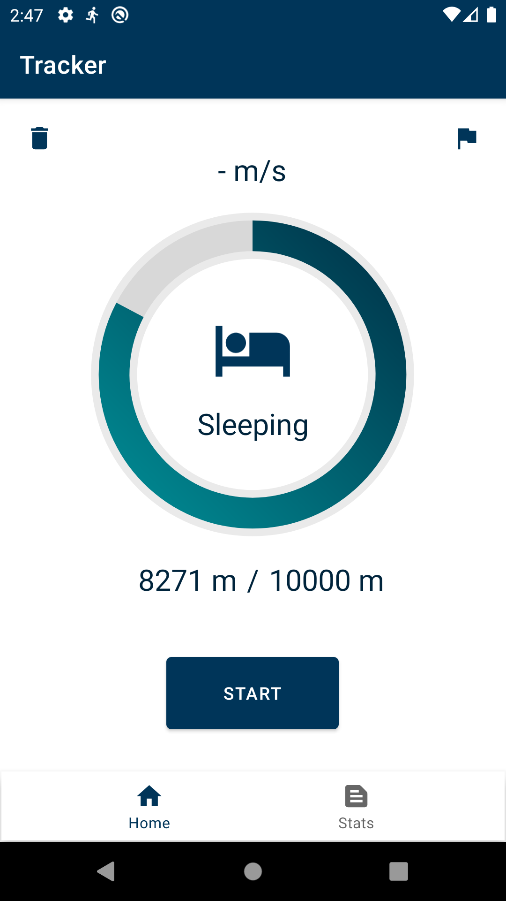
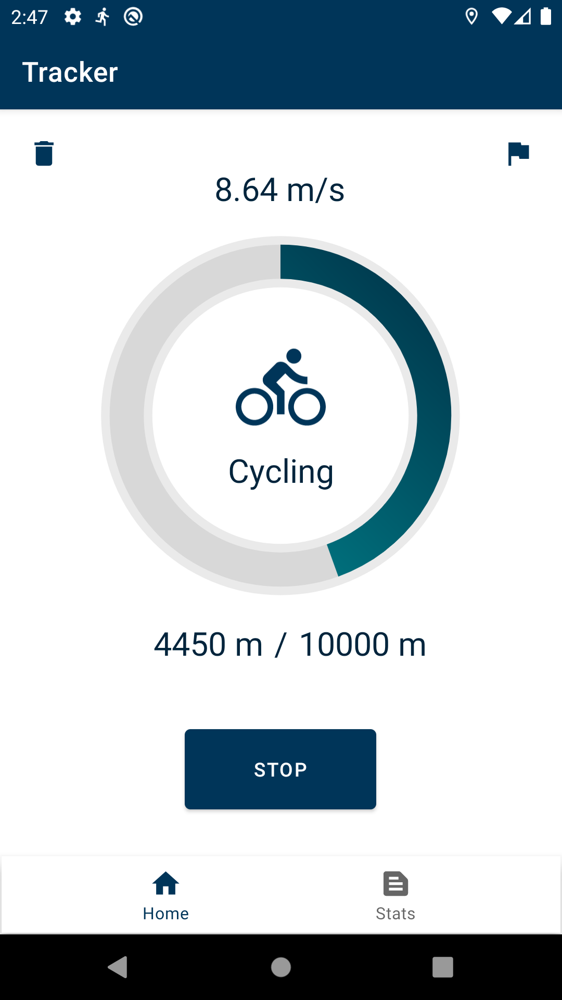
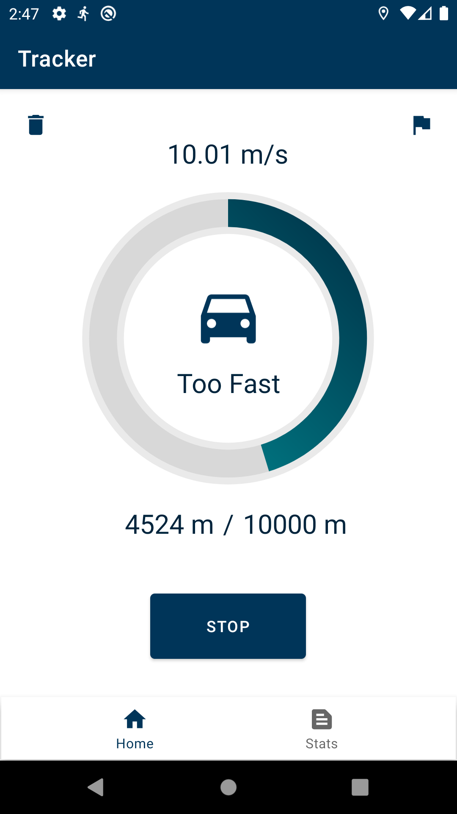
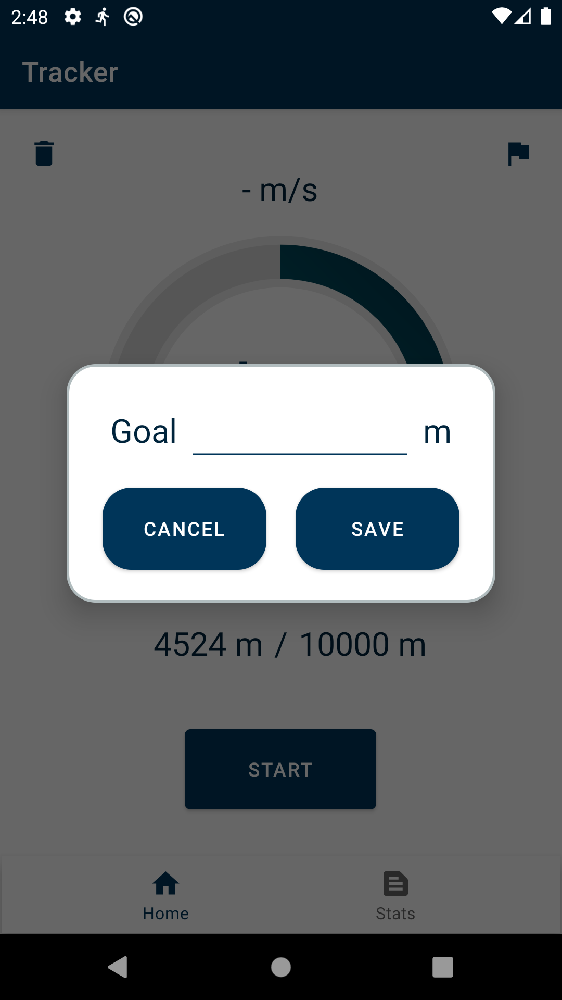
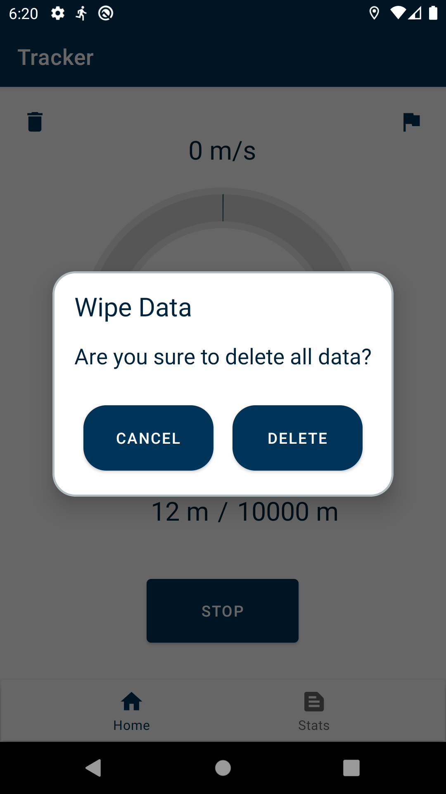
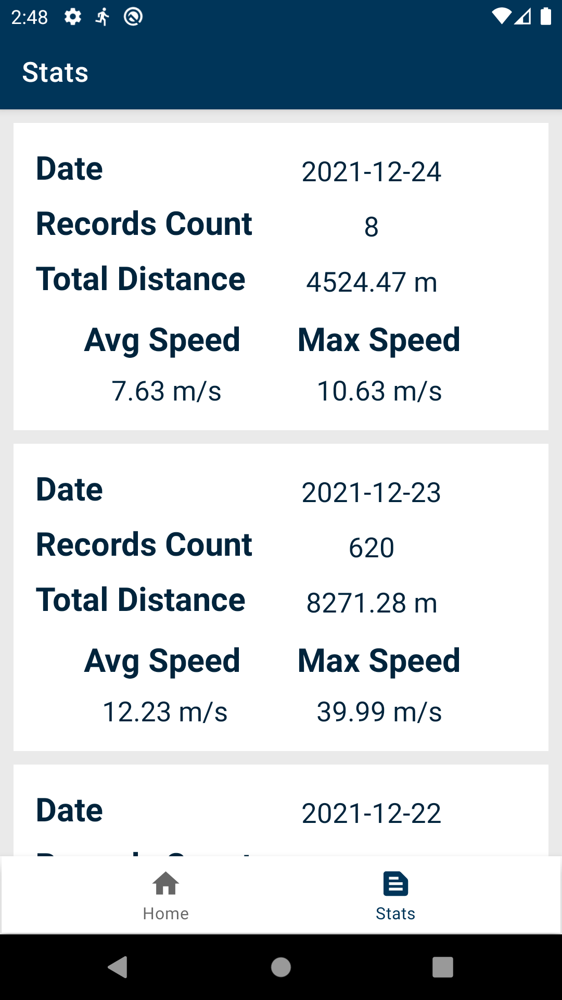

<p align="center" float="left">
    
    
    
    
</p>
<p align="center" float="left">
    
    
    
</p>

# RunningTracker
Simple implementation of Android Running Tracker App

## Installation
- Run with emulator
- Install [APK](app\build\outputs\apk\debug)

## Features
- track current movement (standing, walking, jogging, running, cycling, driving) with gps enabled
- track speed
- track today's travelled distance
- show list of daily travelled history
- remove all records
- allow data access from other application through content provider

## Possible Enhancement
- stored longitudes & latitudes are not displayed, map
- stored elevations are not displayed, elevation graph
- more database queries for different display
- theme and settings

## Implementation

### Folder Structure
```
.
└── runningtracker/
    ├── calculation/
    ├── content_provider/
    ├── model/
    ├── service/
    ├── view_model/
    ├── view_helper/
    └── view/
```
`calculation` contains plain calculations for other class   
`content_provider` allow other application to integrate data with this application   
`model` contains all smaller components that are required for constructing a database   
`service` contains gps location listener service and callbacks interface   
`view_model` view model for GUI state   
`view_helper` contains adapter, decoration & animation stuff   
`view` activities and fragments   

### Components

- MVVM achitecture (View, ViewModel, Model)
    - views, UI that interacts with viewmodels and services
    - viewmodels for storing UI states and interact with repository
    - repository, main part of Model used as an abstraction above database stuff
        - entities as database table row object
        - DAO data acces object for querying entities
        - POJO plain old java object for holding queried data similar to virtual table (views in sql's term)
        - type converter for converting java object into premitive type
    - services
    - content provider

# License
Licensed under the [MIT License](LICENSE).